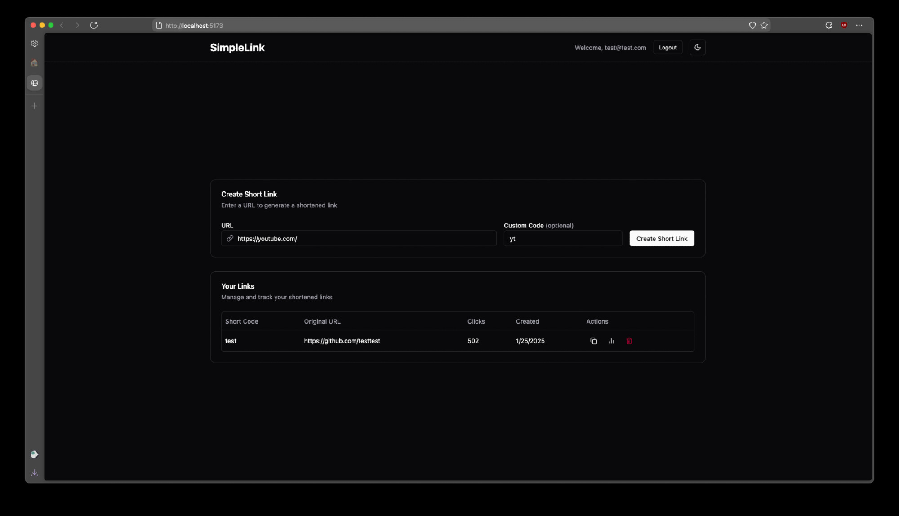
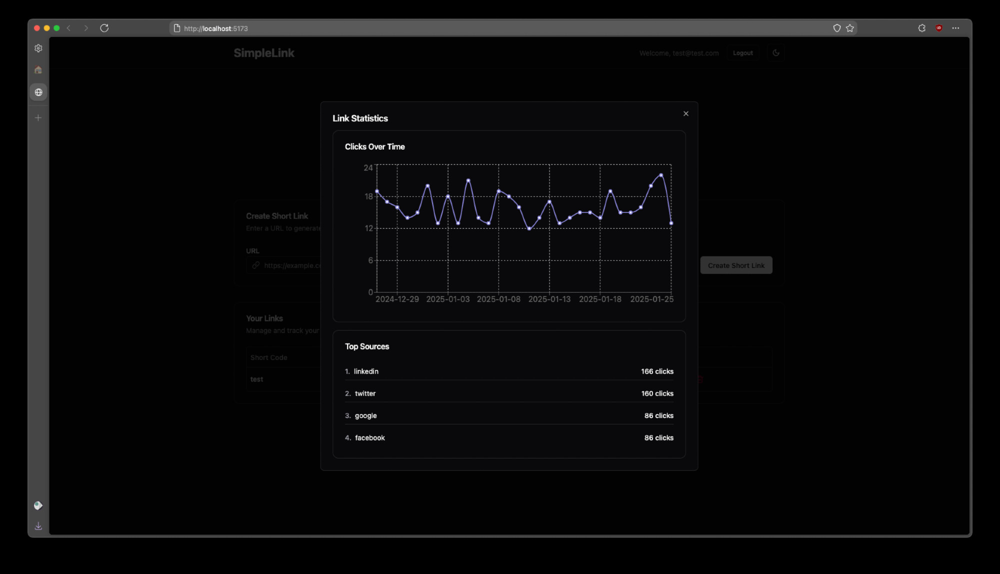

# SimpleLink

A very performant and light (6mb in memory) link shortener and tracker. Written in Rust and React and uses Postgres.





## Build

### From Source

First configure .env.example and save it to .env

If DATABASE_URL is set, it will connect to a Postgres DB. If blank, it will use an sqlite db in /data

```bash
git clone https://github.com/waveringana/simplelink && cd simplelink
./build.sh
cargo run
```

On an empty database, an admin-setup-token.txt is created as well as pasted into the terminal output. This is needed to make the admin account.

Alternatively if you want a binary form

```bash
./build.sh --binary
```

then check /target/release for the binary named `SimpleGit`

### From Docker

```bash
docker build -t simplelink .
docker run -p 8080:8080 \
    -e JWT_SECRET=change-me-in-production \
    -v simplelink_data:/data \
    simplelink
```

### From Docker Compose

Adjust the included docker-compose.yml to your liking; it includes a postgres config as well.
